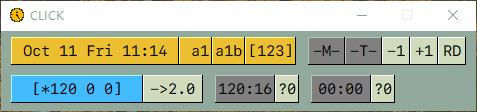

<!--  -->

# ggclick

一个运行在 windows10/11 上的时间和任务管理小工具。

展开全部界面

### 功能

本工具的主要功能包括时间管理、代办管理和纯文本“卡片式”存储。

- 不同的界面可以自由的组合
- 可以对标记的文本进行一定的渲染

#### 时间管理界面

- 计时器可以开始、停止、重置
- 计时器1。统计每天工作时间，单位分钟，分别记录上午、下午、晚上的工作时间
- 计时器2和计时器3。正计时工具，可设置不同的时间阈值。时间达到阈值后会自动闪烁。
- 3个计时器可自由组合

#### 代办事项界面

- 可以打开或者关闭全部7个代办事项
- 显示1个代办事项
- 显示2个代办事项
- 依次类推，最多显示7个代办事项

#### 存储面板界面

一个纯文本“卡片式”存储功能

### 安装

从`release`下载压缩文件，解压到任意文件夹，双击 `ggclick.exe` 即可。

应用第一次启动后，“可能”会有一个弹窗提示需要`pysimplegui`的授权码。请您到`pysimplegui`的官网注册一个授权码，并复制粘贴到弹窗中，此后便可以正常使用了。

填写授权码的步骤，在一台机器上只需要一次，故您可能需要填写，也可能您已经在其他应用使用期间填写过从而不需要这一步。

### 赞助

本应用使用了 `pysimplegui` 进行开发，但是我没有购买`pysimplegui`的商业许可证，故您需要自己注册授权码。

如果您感觉本应用对您有帮助，可以考虑赞助 :smile:
